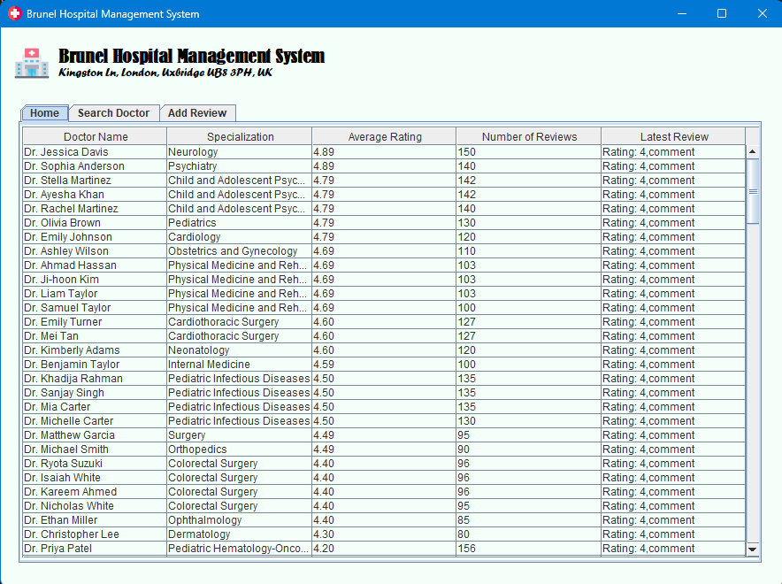
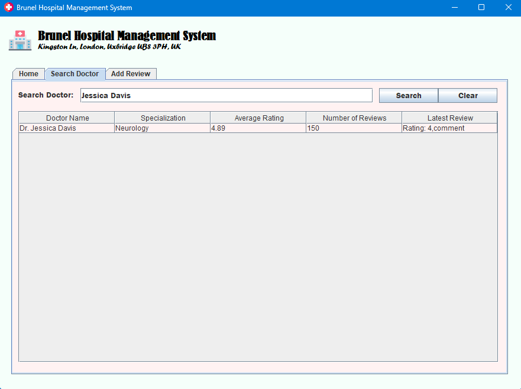
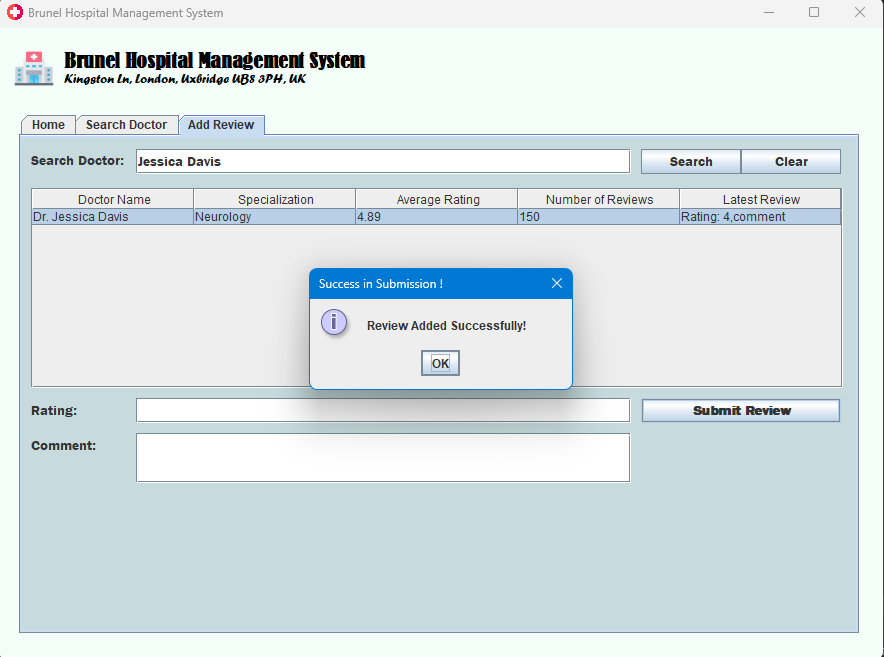
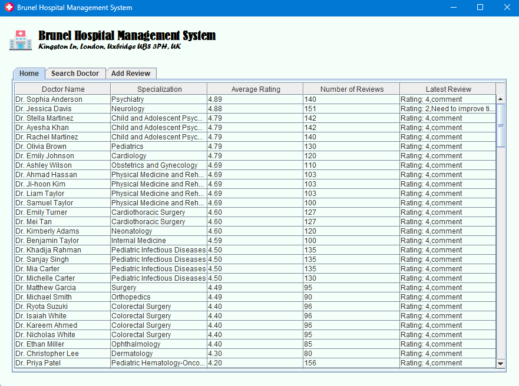

# Brunel Hospital Management System

## Overview
The Brunel Hospital Management System (BHMS) is a Java-based desktop application designed to streamline healthcare review management. It provides an intuitive and user-friendly interface for patients to:
- Search for doctors
- Submit reviews and ratings
- View aggregated ratings and feedback

The system ensures data consistency, error handling, and efficient navigation across multiple windows, making it accessible even to users with minimal technical expertise.

---

## Features
- **Doctor Search** – Patients can search for doctors by name or specialization.
- **Add Reviews** – Patients can rate doctors (1–5) and leave comments.
- **View Ratings** – Displays average ratings, feedback history, and highlights top-rated doctors.
- **Dynamic Updates** – Reviews update in real time without inconsistent UI behavior.
- **Error Handling** – Validates input fields and prevents incorrect submissions.

---

## Screenshots
*(Upload your screenshots in the `images/` folder and reference them here)*

### 1. Home Screen

### 2. Doctor Search

### 3. Add Review

### 3. Updated Home Screen

---

## Technology Stack
- **Language:** Java  
- **GUI:** Swing  
- **Data Storage:** CSV (doctor records and reviews)  
- **Testing:** JUnit and manual interface testing  

---

---

## Usage
- **Home Tab:** View list of doctors with ratings and reviews.  
- **Search Doctor Tab:** Look up doctors by name or specialization.  
- **Add Review Tab:** Submit new ratings and comments.  

---

## Future Improvements
- Enhanced input validation (stricter checks for ratings and comments).  
- Advanced filtering and sorting (by date, keyword, or rating).  
- Role-based access control for patients and administrators.  
- Improved UI/UX with responsive layouts and modern design.  

---

## Author
Developed by **Nafis Alam Tousim**  
Department of Computer Science  
Brunel University London

